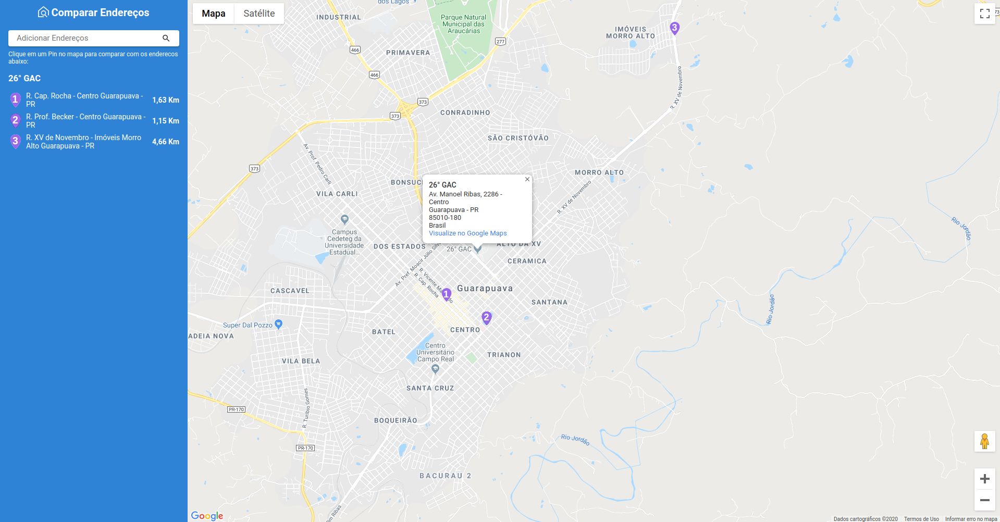

# Compare Addresses
:triangular_ruler: Website to compare distance between addresses



## Running Locally

```sh
yarn install

# start the app on a new terminal window
yarn start

Runs the app in development mode.<br>
Open [http://localhost:3000](http://localhost:3000) to view it in the browser.